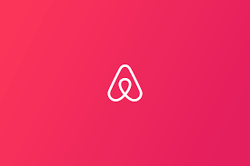

<p align="center">
  <a href="" rel="noopener">
 </a>
</p>

<h3 align="center">Airbnb Clone</h3>
s
<div align="center">

[]()
[](https://github.com/kylelobo/The-Documentation-Compendium/issues)
[](https://github.com/kylelobo/The-Documentation-Compendium/pulls)
[](/LICENSE)

</div>

---

<p align="center"> Few lines describing your project.
    <br> 
</p>

## 📝 Table of Contents

- [📝 Table of Contents](#-table-of-contents)
- [🧐 About ](#-about-)
- [What’s a command interpreter?](#whats-a-command-interpreter)
- [🏁 Getting Started ](#-getting-started-)
  - [Prerequisites](#prerequisites)
- [🔧 Running the tests ](#-running-the-tests-)
  - [Break down into end to end tests](#break-down-into-end-to-end-tests)
- [🎈 Usage ](#-usage-)
- [🚀 Deployment ](#-deployment-)
- [⛏️ Built Using ](#️-built-using-)
- [✍️ Authors ](#️-authors-)
- [🎉 Acknowledgements ](#-acknowledgements-)

## 🧐 About <a name = "about"></a>

This is the first step towards building your first full web application: the AirBnB clone. This first step is very important because you will use what you build during this project with all other following projects: HTML/CSS templating, database storage, API, front-end integration…

Each task is linked and will help you to:

- put in place a parent class (called BaseModel) to take care of the initialization, serialization and deserialization of your future instances
- create a simple flow of serialization/deserialization: Instance <-> Dictionary <-> JSON string <-> file
- create all classes used for AirBnB (User, State, City, Place…) that inherit from BaseModel
- create the first abstracted storage engine of the project: File storage.
- create all unittests to validate all our classes and storage engine

## What’s a command interpreter?

Do you remember the Shell? It’s exactly the same but limited to a specific use-case. In our case, we want to be able to manage the objects of our project:
Its Perfrom CRUD operation

- Create a new object (ex: a new User or a new Place)
- Retrieve an object from a file, a database etc…
  - Do operations on objects (count, compute stats, etc…)
- Update attributes of an object
- Destroy an object

## 🏁 Getting Started <a name = "getting_started"></a>

These instructions will get you a copy of the project up and running on your local machine for development and testing purposes. See [deployment](#deployment) for notes on how to deploy the project on a live system.

### Prerequisites

What things you need to install the software and how to install them.

```
Python3
sudo apt install python3
python3 --verson
```

## 🔧 Running the tests <a name = "tests"></a>

This Explain how to run the automated tests for this system.

### Break down into end to end tests

To Start the console

```python3
./console.py
```

## 🎈 Usage <a name="usage"></a>

Add notes about how to use the system.

## 🚀 Deployment <a name = "deployment"></a>

Add additional notes about how to deploy this on a live system.

## ⛏️ Built Using <a name = "built_using"></a>

- Python
- OOP
- uuid4
- datetime

## ✍️ Authors <a name = "authors"></a>

- [@lovethlaw](https://github.com/lovethlaw) - Idea & Initial work
- [@emosescode](https://github.com/emosescode) - Idea & Initial work

See also the list of [contributors](https://github.com/kylelobo/The-Documentation-Compendium/contributors) who participated in this project.

## 🎉 Acknowledgements <a name = "acknowledgement"></a>

- Hat tip to anyone whose code was used
- Inspiration
- References
